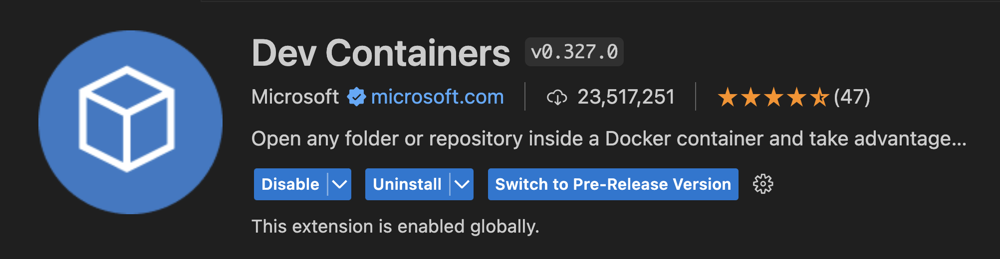
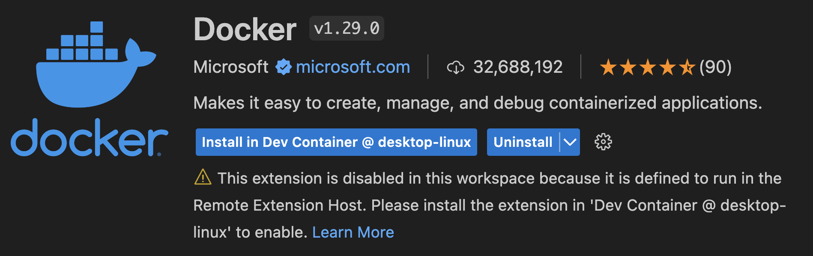
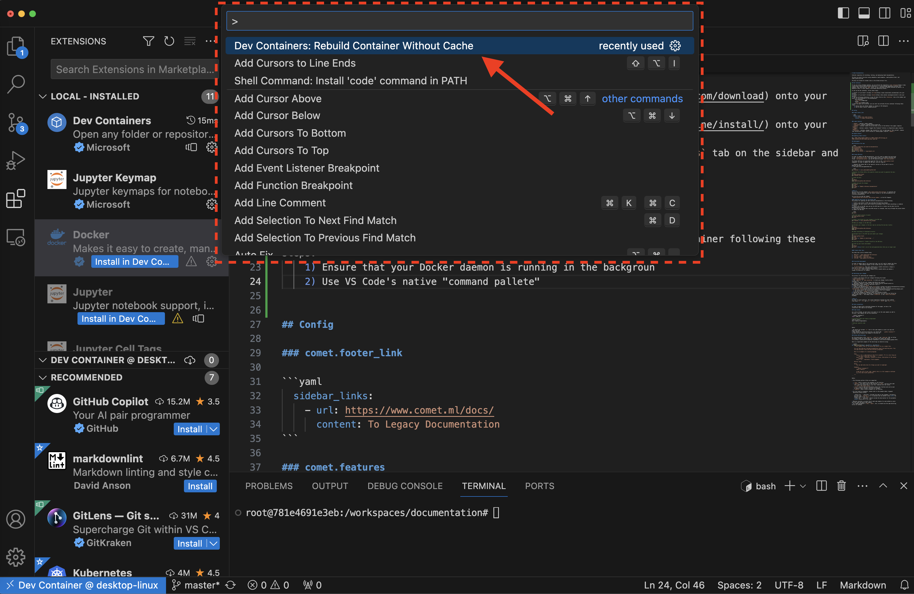

# Project Setup:

You can utilize this repository's [dev container](https://code.visualstudio.com/docs/devcontainers/containers) to reproduce and this project locally on your machine, regardless as to which operating system you are on.

To set up the dev container, follow these steps:

1) Install (if you haven't already) [VS Code](https://code.visualstudio.com/download) onto your machine
2) Install (if you haven't already) [Docker](https://docs.docker.com/engine/install/) onto your machine
3) Add the following extensions to your VS Code (Click on the `Extensions` tab on the sidebar and search for the extensions in the marketplace):
    - `Dev Containers`

      

    - `Docker`

      

4) With the above installed, you can then build the dev container following these steps:
    1) Ensure that your [Docker daemon](https://docs.docker.com/config/daemon/start/) is running in the background
    2) Open up your local `llm_hackathon` repository/folder in VS Code
    3) Use VS Code's native "command pallete" and execute the `Dev Containers: Rebuild Container Without Cache` command (Sometimes VS Code will even prompt you to do so when it recognizes the `.devcontainer/` directory in the repo)

        

        - This should start building your dev container in the background. You'll notice a prompt (usually in the bottom right corner of VS Code) that you can click on to actively watch the logs of

    4) Once the build completes, you're in! You can now open VS Code's native terminal to operate within the container and actively work with and contribute to the `llm_hackathon` repository, just like you would do so normally on your local laptop/machine. 🙂
    5) Now that the dev container is running, open up a new terminal and run `pip install -r requirement.txt` to install all of the necessary Python dependencies.